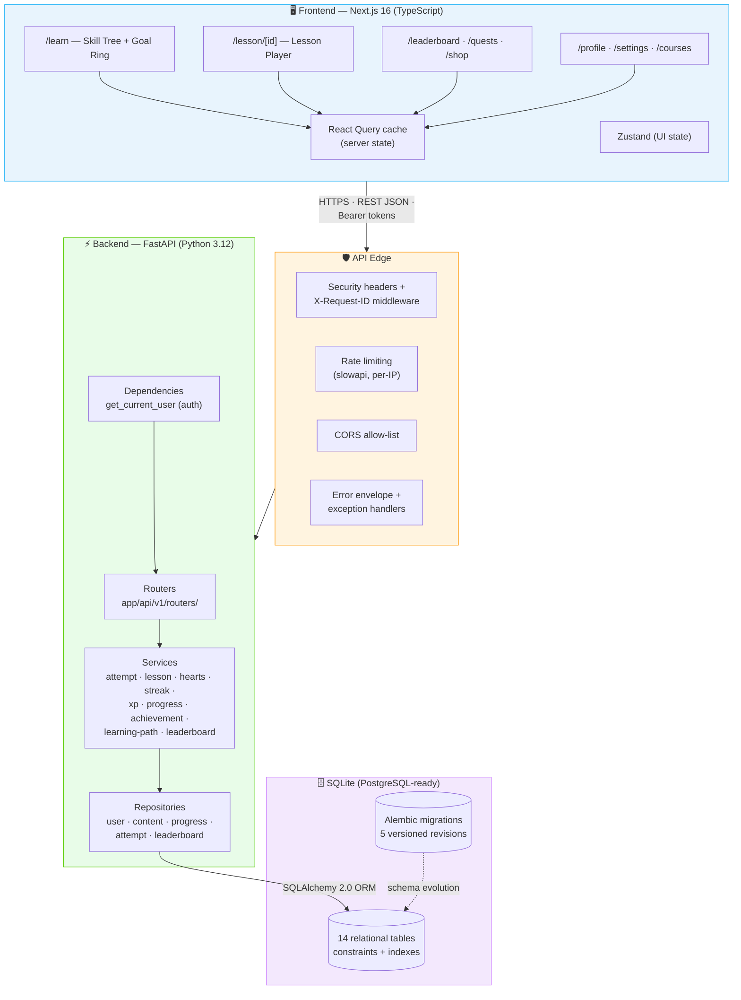
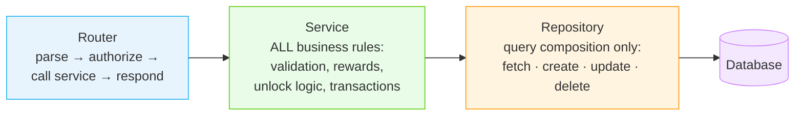
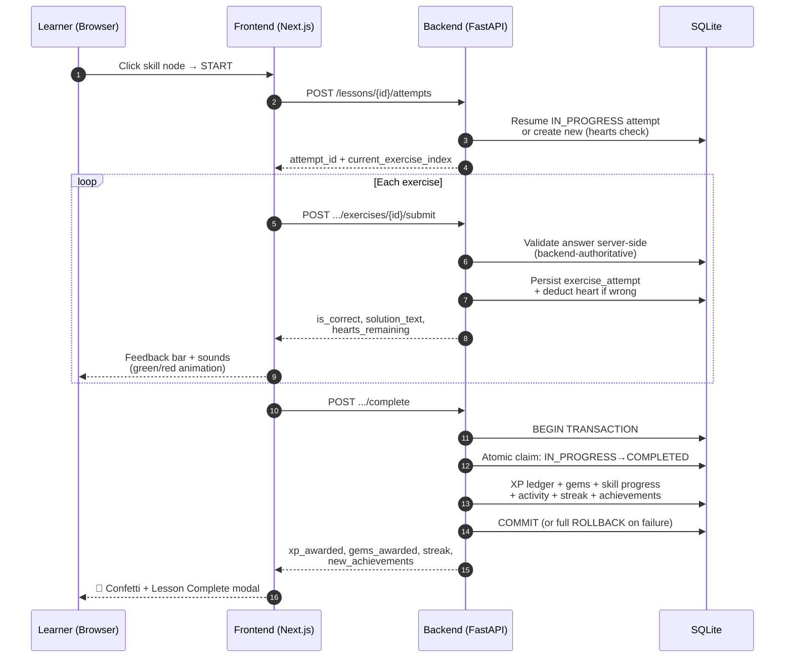
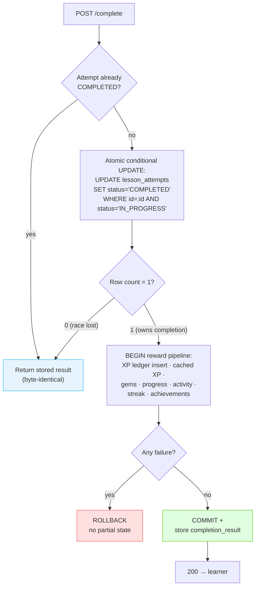
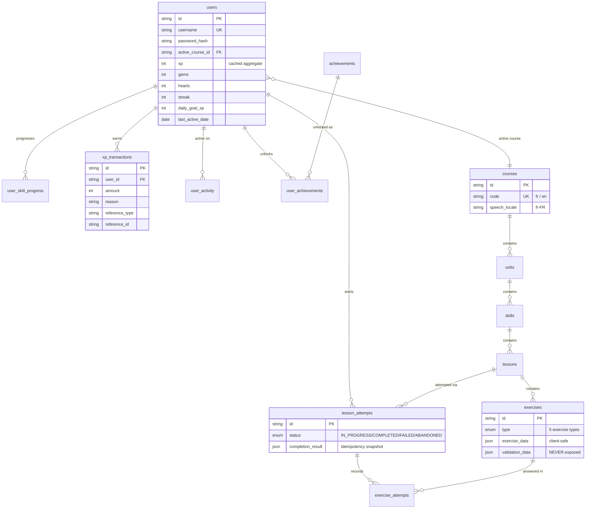
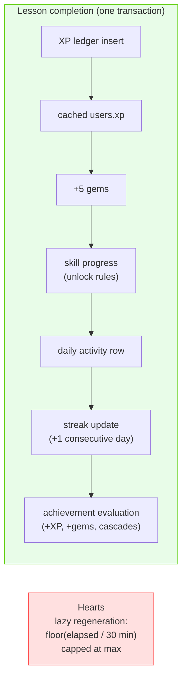

<div align="center">

# 🦉 Duolingo Clone

### A full-stack, production-grade recreation of the Duolingo learning experience

**Learning paths · Interactive lessons · XP · Streaks · Hearts · Gems · Leaderboards · Achievements**

[](https://python.org)
[](https://fastapi.tiangolo.com)
[](https://nextjs.org)
[](https://typescriptlang.org)
[](https://sqlite.org)
[](#-quality-gates)
[](#-quality-gates)

**Built by Ayush Tandon**

</div>

---

## 📖 Table of Contents

1. [Overview](#-overview)
2. [Feature Showcase](#-feature-showcase)
3. [System Architecture](#-system-architecture)
4. [The Lesson Loop (Core Mechanic)](#-the-lesson-loop-core-mechanic)
5. [Atomic Completion — Why XP Can Never Be Awarded Twice](#-atomic-completion--why-xp-can-never-be-awarded-twice)
6. [Database Schema](#-database-schema)
7. [API Reference](#-api-reference)
8. [Gamification Engine](#-gamification-engine)
9. [Security & Production Readiness](#-security--production-readiness)
10. [Quality Gates](#-quality-gates)
11. [Getting Started](#-getting-started)
12. [Testing & Demo Guide](#-testing--demo-guide)
13. [Deployment](#-deployment)
14. [Tech Decisions & Rationale](#-tech-decisions--rationale)
15. [Project Structure](#-project-structure)

---

## 🎯 Overview

This project is a faithful, full-stack recreation of Duolingo — not a generic quiz app. A learner moves through a **winding skill-tree learning path**, plays lessons built from **five interactive exercise types**, earns **XP and gems**, maintains a **daily streak**, loses and regenerates **hearts**, competes on a **live weekly leaderboard**, and unlocks **achievements** — all inside the playful, colorful, mascot-fueled interface that defines Duolingo.

**The backend is authoritative.** The client never decides answer correctness, XP, heart counts, streaks, or unlock states — every one of those is computed and persisted server-side, inside database transactions.

| Layer | Technology | What it does |
|---|---|---|
| **Frontend** | Next.js 16 (App Router) · TypeScript · Tailwind v4 · React Query · Zustand · Framer Motion | Duolingo-accurate UI, optimistic-free server-state fetching, animations, TTS narration |
| **Backend** | Python 3.12 · FastAPI · SQLAlchemy 2.0 · Pydantic v2 · Alembic | REST API, business rules, gamification engine, persistence |
| **Database** | SQLite (PostgreSQL-ready) | 14-table relational schema with constraints and indexes |
| **Quality** | pytest (103 tests) · mypy · ruff · bandit · pip-audit · 94% coverage | Enforced in CI on every push |

---

## ✨ Feature Showcase

### 🗺️ Learning Path / Skill Tree
- Signature **sinusoidal winding path** with unit banners in Duolingo's rotating palette
- Skill nodes with **four server-resolved states** — `LOCKED 🔒` / `AVAILABLE ▶` / `IN_PROGRESS 🔄` / `COMPLETED 👑` (crown)
- **Radial progress rings** around active nodes, floating `START` bubbles, clickable lesson popovers with XP rewards
- Live **top bar**: streak flame 🔥, gems 💎, hearts ❤️, course flag — all real data from the API
- **Daily goal ring** — a circular flame indicator that fills with today's XP and flips to gold when the goal is met

### 🎮 Lesson Player (the core loop)
- **Five exercise types**, each a faithful rebuild:
  1. **Multiple Choice** — tactile 3D buttons, keyboard hotkeys (1/2/3), character illustrations
  2. **Word Bank translation** — tap-to-select pills that snap into the answer tray and back
  3. **Match Pairs** — tile matching with selection feedback and pair elimination
  4. **Fill in the Blank** — sentence with a blank slot and choice chips
  5. **Type the Answer** — text input with accent helpers and smart normalization
- **Signature feedback bar** — sliding green "Nicely done!" / red "Correct solution:" sheet with chunky CONTINUE button
- **Hearts**: wrong answers crack a heart; hitting zero fails the lesson (no XP) and opens the Out-of-Hearts modal
- **Native-tongue narration** — every word/sentence can be spoken via Web Speech API in the course's locale (`fr-FR`, `en-US`)
- **Resume after refresh** — every lesson run is a persistent server-side attempt; a page reload reconstructs exact position, hearts, and history
- **Lesson Complete modal** — confetti cannons, fanfare, XP/gems/streak/accuracy cards, achievement banners

### 🏆 Gamification
| Mechanic | Behavior |
|---|---|
| **XP** | Per-lesson rewards + achievement bonuses; full auditable ledger (`xp_transactions`) |
| **Streaks** | +1 per consecutive active day, resets on a gap; simulators built into the dev sandbox |
| **Hearts** | 5 max, −1 per wrong answer, lazy regeneration (1/30 min), 350-gem or free practice refill |
| **Gems** | +5 per lesson, +10 per achievement, spent on heart refills |
| **Leaderboard** | Live weekly league — seeded bots + every real learner's XP derived from the ledger |
| **Achievements** | Generic criteria engine (first lesson, XP thresholds, streaks, skills) with XP + gem rewards |
| **Daily goal** | Persisted per user, editable in Settings, visualized as the goal ring |

### 👤 Accounts & Persistence
- **Real authentication** — register/login with PBKDF2-HMAC-SHA256 (100k iterations, per-user salt) and HMAC-signed bearer tokens
- **Two seeded courses** — French 🇫🇷 (default, with partial demo progress) and English 🇬🇧, switchable per user
- **Profile page** — stat cards, lifetime stats, achievement gallery with locked/unlocked states
- **Quests & Shop** — real daily XP/lesson quests, working 350-gem heart refill purchase
- **Settings** — daily-goal editor (persisted), sound toggle, dark mode, Coming-Soon placeholders

---

## 🏗️ System Architecture

A clean **modular monolith**: one deployable FastAPI app with strict layering. Routers stay thin, services own all business logic, repositories own all queries, and Pydantic schemas guard every boundary.



**Layer responsibilities:**



---

## 🔁 The Lesson Loop (Core Mechanic)

Every lesson run is a durable server-side **`LessonAttempt`** — the foundation for refresh recovery, analytics, and idempotent completion.



**Wrong answer path**: deduct 1 heart → learner retries the same exercise → hearts at zero ⇒ attempt status becomes `FAILED`, no XP is awarded, and the Out-of-Hearts modal offers a gem refill (350) or free practice refill.

---

## 🔐 Atomic Completion — Why XP Can Never Be Awarded Twice

Lesson completion is the most safety-critical flow. Three independent layers guard it:



1. **Atomic claim** — a single conditional UPDATE with a row-count check decides which concurrent request owns completion
2. **Database constraint** — `UNIQUE(user_id, reason, reference_type, reference_id)` on `xp_transactions` makes a duplicate reward physically impossible
3. **Stored snapshot** — the completion result is persisted on the attempt, so retries return the identical payload

This is proven by tests: duplicate-completion awards exactly one XP transaction, and a simulated mid-transaction failure rolls back the XP award, status, and progress together.

---

## 🗄️ Database Schema

14 tables, UUID primary keys, timezone-aware timestamps, foreign keys with cascade rules, check constraints, and indexes on every query path.



**Data-secrecy rule**: `exercises.exercise_data` (prompts, word banks, options) is safe for clients; `exercises.validation_data` (correct answers) **never crosses the API boundary** — enforced by separate Pydantic schemas and a single conversion choke point, with leak tests guarding it.

**Duplicate-reward guard**: `xp_transactions` enforces a composite `UNIQUE(user_id, reason, reference_type, reference_id)` constraint at the database layer, making duplicate rewards physically impossible.

---

## 🌐 API Reference

All routes are mounted under **both `/api`** (frontend contract) **and `/api/v1`** (versioned convention). Full interactive docs at **`/docs`** (Swagger) once running.

| Method | Endpoint | Description |
|---|---|---|
| `GET` | `/api/health` · `/api/health/ready` | Liveness / DB readiness probes |
| `POST` | `/api/register` · `/api/login` | Create account / obtain bearer token |
| `GET` | `/api/me` | Current learner's profile |
| `GET` | `/api/courses` | Course catalog (with narration locales) |
| `GET` | `/api/learning-path?course_id=` | Units → skills with server-resolved states + stats |
| `POST` | `/api/profile/course` | Switch active course |
| `PATCH` | `/api/profile/settings` | Update daily goal |
| `GET` | `/api/lessons/{id}` | Lesson with client-safe exercises (no answers) |
| `POST` | `/api/lessons/{id}/attempts` | Start or resume an attempt |
| `GET` | `/api/lesson-attempts/{id}` | Resume/reconstruction payload |
| `POST` | `/api/lesson-attempts/{id}/exercises/{id}/submit` | Server-side answer validation |
| `POST` | `/api/lesson-attempts/{id}/complete` | Atomic completion + rewards (idempotent) |
| `POST` | `/api/lesson-attempts/{id}/abandon` | Abandon attempt |
| `GET` | `/api/profile` · `/api/profile/stats` · `/api/profile/activity` | Profile, aggregates, cursor-paginated history |
| `GET` | `/api/hearts` · `POST /api/hearts/refill?is_practice=` | Heart state / gem or free refill |
| `GET` | `/api/leaderboard` | Weekly league (ranked array) |
| `GET` | `/api/achievements` | All achievements with unlock state |
| `POST` | `/api/dev/simulate-day` · `/api/dev/reset-progress` | Dev-only tools (never mounted in production) |

**Errors are always one envelope:**

```json
{
  "detail": { "code": "ATTEMPT_NOT_IN_PROGRESS", "message": "…" },
  "request_id": "a1b2c3d4e5f6"
}
```

---

## 🎰 Gamification Engine



- **Lazy heart regeneration** — no background worker; every access replays elapsed time since `hearts_updated_at`, preserving partial progress toward the next heart
- **Answer normalization** — configurable per exercise (case/accents/punctuation), so accents are honored for French vocabulary but relaxed for translation exercises
- **Leaderboard** — bot competitors are seeded static; every real learner's weekly XP is **derived live from the XP ledger** (never duplicated)
- **Achievements** — a generic criteria dispatcher (`FIRST_LESSON`, `TOTAL_XP`, `STREAK_THRESHOLD`, `SKILLS_COMPLETED`, `LESSONS_COMPLETED`); adding a new achievement is data, not code

---

## 🛡️ Security & Production Readiness

| Control | Implementation |
|---|---|
| Authentication | PBKDF2-HMAC-SHA256 (100k iterations, per-user salt) + HMAC-SHA256 signed tokens with expiry |
| Authorization | Every attempt/progress access verifies ownership — foreign attempts return 404 (no existence oracle) |
| Rate limiting | slowapi per-IP: general 100/min · submissions 30/min · completions 10/min · auth 20/min · dev 20/min — all configurable |
| Security headers | `X-Content-Type-Options` · `X-Frame-Options: DENY` · `Referrer-Policy` · `Permissions-Policy` · no `Server` leak |
| Request tracing | `X-Request-ID` generated per request → logs, responses, error bodies |
| CORS | Explicit origins; production startup **exits** if unset |
| Input validation | Pydantic everywhere; domain limits (answers ≤500 chars, ≤20 words/pairs, pagination ≤100) |
| Answer secrecy | `validation_data` never serialized; leak-tested |
| Error safety | Stack traces/SQL details to logs only; generic 500s in production |
| Startup validation | Production refuses `DEBUG=true`, dev tools, dev secrets, empty CORS |
| Migrations | Alembic chain (5 revisions); verified on clean DB with downgrade round-trip |

**Observability**: structured `event=key=value` logs for app start, attempt start, lesson completion, login outcomes, and failures — every line carries the request ID.

---

## ✅ Quality Gates

All of these pass and are enforced in CI (`.github/workflows/backend-ci.yml`) on every push/PR:

```bash
ruff format --check .   # formatting
ruff check .            # lint
mypy app/               # static types (73 files)
pytest --cov=app        # 103 tests · 94% coverage
bandit -r app/          # static security analysis
pip-audit               # dependency vulnerabilities
```

**Test suite composition:**
- **Unit** — hearts (deduction/regen/caps/timestamps), streaks (day boundaries), XP idempotency, every exercise type + normalization matrix, achievement thresholds
- **Integration** — full lesson flow, wrong-answer → failed flow, duplicate completion (single XP transaction), resume-after-refresh, abandon, locked lessons, cross-lesson rejection, leaderboard math, pagination
- **Security** — auth flows, cross-user ownership (404s), oversized/malformed input, error envelope shape, security headers, answer-leak checks
- **Transaction** — simulated mid-completion failure proves full rollback (no partial XP, no partial progress)

---

## 🚀 Getting Started

### Prerequisites
- **Python 3.12+** · **Node.js 18+**

### 1 · Backend

```bash
cd backend

# Create and activate a virtual environment
python -m venv .venv
# Windows:
.\.venv\Scripts\activate
# macOS / Linux:
source .venv/bin/activate

# Install dependencies
pip install -r requirements.txt

# Configure (defaults are development-safe)
cp .env.example .env

# Apply migrations and seed demo data (idempotent)
alembic upgrade head
python -m app.seed.seed_database

# Start the API → http://127.0.0.1:8000
uvicorn app.main:app --reload
```

> **Seeded demo account**: `demo_learner` / `duolingo123` — French course with partial progress (a completed skill, an in-progress skill, locked skills beyond).

> Interactive API documentation: **http://127.0.0.1:8000/docs**

### 2 · Frontend

```bash
cd frontend

npm install
npm run dev        # → http://localhost:3000
```

No configuration needed — the frontend defaults to `http://127.0.0.1:8000/api`. To point elsewhere, set `NEXT_PUBLIC_API_URL`.

### 3 · Verify everything

```bash
# Backend quality suite
cd backend && python -m pytest tests

# API smoke test (server must be running + seeded)
cd backend && python scripts/verify.py
```

---

## 🧪 Testing & Demo Guide

A click-path that exercises every core feature:

1. **Landing page** → **GET STARTED** → register a new account (or log in as `demo_learner`)
2. **Onboarding** → pick French or English, choose a daily goal → both are persisted
3. **Learn path** → observe the daily goal ring, streak/gems/hearts, completed skill with crown, IN_PROGRESS node with ring, locked nodes
4. **Click a node → START** → lesson player: answer correctly (green bar + chime), answer incorrectly (red bar + heart cracks + solution shown)
5. **Lose all hearts** → Out-of-Hearts modal → practice refill (free) or gem refill (350 💎)
6. **Finish a lesson** → confetti + XP/gems/streak cards → path updates (progress ring advances, node may crown, leaderboard moves)
7. **Refresh mid-lesson** → exact resume from the last exercise with hearts/history intact
8. **Leaderboard** → your row vs. seeded bots, promotion zone highlighted
9. **Quests / Shop / Profile / Settings** → real daily progress, working gem purchase, stats, goal editor
10. **Dev sandbox** (wrench icon in the sidebar, dev mode only) → simulate day transitions to demo streak logic, reset progress

---

## ☁️ Deployment

The backend ships with a production Dockerfile (non-root user, health check, migrate + seed entrypoint):

```bash
# Backend (Render / Railway / Fly — all work with the included Dockerfile)
docker build -t language-learning-api ./backend
docker run -p 8000:8000 language-learning-api
# or, for local orchestration:
docker compose -f backend/docker-compose.yml up
```

**Production environment variables:**

```env
ENVIRONMENT=production
SECRET_KEY=<random 32+ char secret>
CORS_ORIGINS=https://your-frontend.vercel.app
ENABLE_DEV_TOOLS=false
RATE_LIMIT_ENABLED=true
```

**Frontend** (Vercel): set the project root to `frontend/` and `NEXT_PUBLIC_API_URL=https://<backend-host>/api`.

> SQLite needs a persistent volume on your host (Railway volume / Render disk). The schema and code are PostgreSQL-portable — only `DATABASE_URL` changes.

---

## 🧠 Tech Decisions & Rationale

| Decision | Why |
|---|---|
| **FastAPI** | Fast development, native typing, Pydantic validation, auto OpenAPI docs — ideal for a typed, contract-first API |
| **Next.js App Router** | Server components + file-based routing for a multi-page app with client-heavy interactive islands |
| **Modular monolith, no microservices** | Domain complexity doesn't justify distributed-system overhead; strict internal layering gives the same separation with none of the cost |
| **Service layer** | Keeps HTTP concerns out of business rules; the gamification engine is testable without a web server |
| **Repository layer** | Centralizes query composition; services never build queries, repositories never make business decisions |
| **Attempt-based lessons** | Enables persistence, refresh recovery, analytics, and idempotent completion in one design |
| **XP transactions ledger** | Auditable reward history; the unique reference constraint makes duplicate rewards physically impossible |
| **Atomic completion claim** | A conditional UPDATE + row-count check wins races; no double XP under concurrent requests |
| **Lazy heart regeneration** | Deterministic time-based calculation with zero background workers — simpler and testable |
| **Pydantic at every boundary** | Unvalidated dicts never travel through the app; exercise answers are shape-checked per type |
| **SQLite + Alembic** | Zero-config for the assignment; migrations keep the schema honest and PostgreSQL-portable |
| **React Query for server state** | One cache per resource — a lesson completion invalidates "learningPath" and the whole UI updates consistently |

---

## 📁 Project Structure

```text
.
├── .github/workflows/backend-ci.yml   # CI: ruff → mypy → pytest+cov → bandit → pip-audit
│
├── backend/
│   ├── app/
│   │   ├── api/
│   │   │   ├── v1/routers/            # thin endpoints (auth, attempts, lessons, profile, …)
│   │   │   │   └── router.py          # v1 aggregation (v2-ready convention)
│   │   │   └── dependencies.py        # get_current_user — the single auth seam
│   │   ├── core/                      # config, database, logging, auth utils, security
│   │   │                              # middleware, rate limiting, exceptions, error handlers
│   │   ├── models/                    # SQLAlchemy models (14 tables)
│   │   ├── schemas/                   # Pydantic request/response contracts
│   │   ├── repositories/              # query layer
│   │   ├── services/                  # business logic (10 focused services)
│   │   ├── utils/                     # answer normalization, pagination, dates
│   │   ├── seed/                      # idempotent seed system
│   │   └── main.py                    # app factory: startup validation, middleware
│   ├── alembic/                       # 5 versioned migrations
│   ├── scripts/                       # seed.py, verify.py (API smoke test)
│   ├── tests/                         # unit + integration + security + transaction
│   ├── Dockerfile                     # non-root, healthchecked, migrate+seed entrypoint
│   ├── docker-compose.yml
│   ├── pyproject.toml                 # ruff / pytest / mypy / coverage config
│   ├── requirements.txt
│   └── .env.example
│
├── frontend/
│   └── src/
│       ├── app/                       # App Router pages (learn, lesson, leaderboard,
│       │                              # quests, shop, profile, settings, courses, register)
│       ├── components/                # lesson exercises, learn path, modals, sidebar,
│       │                              # mascot, daily-goal ring, live widgets
│       ├── hooks/                     # useUserData (React Query), useSound (TTS + SFX)
│       ├── lib/                       # api client, sounds, question assets
│       ├── stores/                    # Zustand preferences
│       └── types/                     # API contract types
│
└── README.md
```

---

<div align="center">

**Duolingo Clone** — built as an SDE fullstack assignment with production-grade engineering.

Made with 🦉 by **Ayush Tandon**

</div>
