# 🦉 Duolingo Web App Clone (SDE Fullstack Assignment)

A pixel-accurate, playful, and responsive web application replicating Duolingo's core learning path, interactive lesson player loop, and gamification workflows.

Built with **Next.js (TypeScript)** on the frontend and **Python FastAPI (SQLite)** on the backend.

---

## 🌟 Highlights & Features

### 1. Learning Path / Skill Tree
- **Duolingo Home Path**: Signature winding path with unit banners, active lesson markers, crown counters, and lock/unlock state progression.
- **Top Navigation Bar**: Live streak flame counter, total XP badge, gem counter, and animated heart refill counter.

### 2. Interactive Lesson Player (The Core Loop)
- **5 Varied Exercise Types**:
  1. **Multiple Choice (`SELECT`)**: Card-based image/text questions with 3D tactile buttons and keyboard shortcuts (1, 2, 3).
  2. **Translate Word Bank (`TRANSLATE`)**: Interactive tap-to-select pills that snap between word bank and answer tray.
  3. **Match Pairs (`MATCH`)**: Dynamic tile matching for vocabulary pairs with real-time selection feedback and pair elimination.
  4. **Fill in the Blank (`FILL_BLANK`)**: Missing word prompt with multiple choice chips.
  5. **Type the Answer (`TYPE_ANSWER`)**: Real text input with accent helpers and case/punctuation normalized validation.
- **Signature Feedback Bar**: Smooth sliding bottom sheet with distinct green "Nicely done!" / red "Correct solution:" banners and chunky continue button.
- **Audio & Pronunciation**: Browser Web Speech API for native Spanish pronunciation + synthesized chimes for correct/incorrect answers.

### 3. Gamification & Persistence
- **Hearts System**: 5 max hearts; lose 1 heart on incorrect answers; automatic regeneration (1 heart every 30 minutes) + Gem refill / Practice refill modal.
- **Streak Tracker**: Increments on daily lesson completion. Includes a built-in **Streak Simulator** button to test day advancement and streak resets.
- **Weekly Leaderboard**: Competitive leaderboard league (Bronze/Silver/Gold) seeded with active bot learners and real rank calculation.
- **Achievements / Badges**: Milestones for streaks (Wildfire), XP earned (Sage), accuracy (Sharpshooter), and vocabulary (Scholar).
- **Learner Profile**: Personal statistics page detailing streak, total XP, crowns, league rank, and unlocked badges.

---

## 🏗️ Architecture Overview

```mermaid
graph LR
    subgraph Client ["Frontend (Next.js 14+ App Router)"]
        UI_Home["/learn (Skill Tree)"]
        UI_Lesson["/lesson/[id] (Player Loop)"]
        UI_Leaderboard["/leaderboard (Leagues)"]
        UI_Profile["/profile (User Stats)"]
        UI_Shop["/shop (Heart Refills)"]
    end

    subgraph Server ["Backend (Python FastAPI)"]
        API_Courses["/api/courses/current"]
        API_Lessons["/api/lessons/{id}"]
        API_Complete["/api/lessons/{id}/complete"]
        API_User["/api/user/profile"]
        API_Hearts["/api/user/hearts/refill"]
        API_Streak["/api/user/streak/simulate"]
        API_LB["/api/leaderboard"]
    end

    subgraph Storage ["Database (SQLite)"]
        DB[(duolingo.db)]
    end

    Client -->|HTTP REST JSON| Server
    Server -->|SQLAlchemy ORM| Storage
```



---

## 🗄️ Database Schema Design

The SQLite database uses clean relational design managed by SQLAlchemy:

- **`users`**: Learner credentials, avatar, total XP, current hearts, gems, streak counter, last active date, and heart replenishment timestamps.
- **`courses`**: Supported languages (e.g. Spanish `es`), title, flag icon, learner stats.
- **`units`**: Curriculum modules with title, description, order, and customizable banner theme color.
- **`skills`**: Skill path nodes containing icon, title, crown milestones, and assigned unit.
- **`lessons`**: Sub-units containing ordered exercises and XP rewards.
- **`exercises`**: Exercise prompts, type enum (`SELECT`, `TRANSLATE`, `MATCH`, `FILL_BLANK`, `TYPE_ANSWER`), TTS audio prompts, and structured JSON payloads for options and solutions.
- **`user_skill_progress`**: Tracks crowns earned, completion status, and timestamps per learner.
- **`user_lesson_progress`**: Individual lesson attempts, completion flags, and accuracy scores.
- **`user_activity`**: Daily log of XP earned and lesson counts for streak calculations.
- **`achievements` & `user_achievements`**: Gamification badges with progress requirements.
- **`leaderboard`**: Weekly league rankings and bot competitors.

---

## 🚀 Getting Started Locally

### Prerequisites
- Node.js (v18+) & npm
- Python (3.9+)

### 1. Backend Setup (FastAPI)
```bash
# Navigate to backend
cd backend

# Activate virtual environment
# Windows:
.\venv\Scripts\activate
# macOS/Linux:
source venv/bin/activate

# Install dependencies
pip install -r requirements.txt

# Run backend API server (runs on http://localhost:8000)
python run.py
```
> The backend automatically creates and seeds `duolingo.db` on startup with units, lessons, exercises, achievements, and leaderboard competitors.
> API Documentation is available interactively at: `http://localhost:8000/docs`

### 2. Frontend Setup (Next.js)
```bash
# In a new terminal, navigate to frontend
cd frontend

# Install dependencies (if not already installed)
npm install

# Start development server (runs on http://localhost:3000)
npm run dev
```

Open [http://localhost:3000](http://localhost:3000) in your browser.

---

## 🧪 Testing Gamification Features

- **Streak Logic**: Open the test panel on the Profile page or call `POST /api/user/streak/simulate?days_to_advance=1` to simulate a day passing and verify streak increments or freezes.
- **Hearts Depletion & Refill**: Intentionally choose wrong answers during a lesson to trigger the cracking heart animation and test the Out of Hearts modal and Gem refill mechanism.
- **Sound Effects**: Audio chimes and Web Speech API pronunciation automatically play during exercise evaluation.
